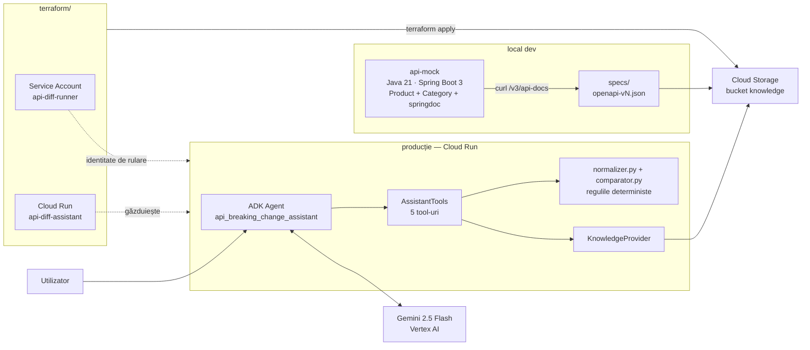
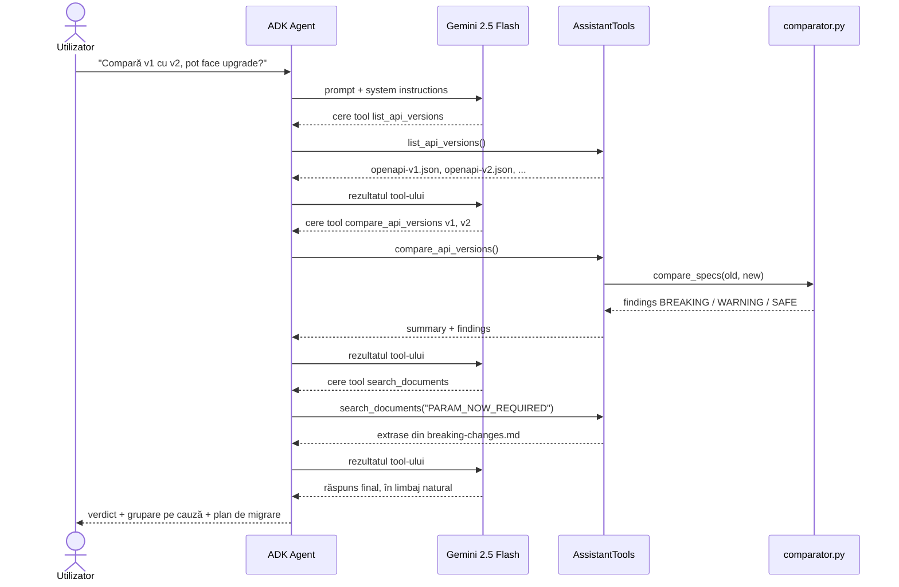
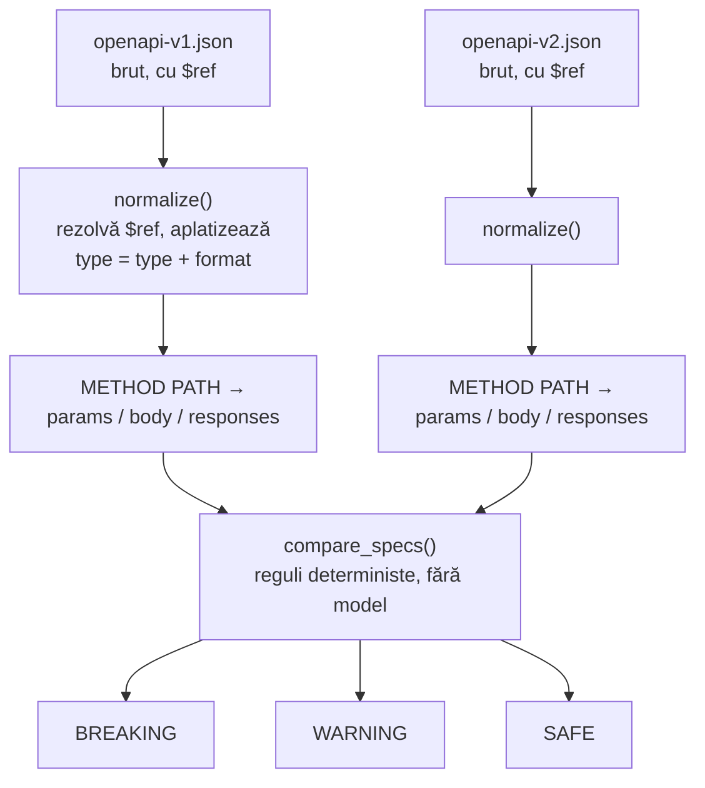

# apidiff — API Breaking-Change Assistant

Un agent ADK compară două specificații OpenAPI, decide **determinist** ce s-a stricat pentru clienți, iar Gemini explică verdictul în limbaj natural.

> **Python decide, Gemini explică.** Java generează datele de test, Terraform provizionează infrastructura.


---

## Problema

Orice echipă de backend strică din când în când clienți existenți printr-un API nou, fără să-și dea seama. Nu din neglijență — diff-ul text dintre două specificații OpenAPI are sute de linii, majoritatea zgomot, și nimeni nu-l citește rând cu rând înainte de fiecare release.

Cele mai periculoase schimbări arată nevinovate: un `required = false` devenit `required = true`, sau un `Double` devenit `BigDecimal`. Un diff text arată ambele modificări identic cu oricare alta — dar ambele pică producția.

**Ce rezolvă proiectul:** compară automat două versiuni ale unui API și spune, determinist, care schimbări sunt `BREAKING`, `WARNING` sau `SAFE` — și de ce, în termeni de ce pățește exact un client existent.

---

## API-ul de test (v1)

Un mic Spring Boot cu produse, 5 endpoint-uri:

| Endpoint | Variabile primite | Ce întoarce |
| --- | --- | --- |
| `GET /api/products` | `category` (opțional) — enum: `ELECTRONICS`, `CLOTHING`, `FOOD`, `BOOKS` | `Product[]` |
| `GET /api/products/{id}` | `id` (path, obligatoriu) — integer | `Product` |
| `POST /api/products` | body: `Product` — id, name, sku, description, price (double), category, available | `Product` |
| `PUT /api/products/{id}` | `id` (path) + body: `Product` | `Product` |
| `DELETE /api/products/{id}` | `id` (path, obligatoriu) — integer | `200 OK` |

### Ce schimbă v2 — exact ce trebuie detectat

Aceleași endpoint-uri, după trei modificări plantate deliberat în codul Java. Fiecare pare o modificare minoră. Fiecare strică toți clienții existenți care făceau exact ce era permis în v1.

**1. Un endpoint dispare complet** — `ENDPOINT_REMOVED`

```diff
- DELETE /api/products/{id}
```

Orice client care mai apelează `DELETE` primește 404 imediat după deploy.

**2. Un parametru opțional devine obligatoriu + o valoare de enum dispare** — `PARAM_NOW_REQUIRED`, `PARAM_ENUM_VALUE_REMOVED`

```diff
- @RequestParam(required = false) Category category;  // ELECTRONICS, CLOTHING, FOOD, BOOKS
+ @RequestParam(required = true)  Category category;  // ELECTRONICS, CLOTHING, FOOD
```

Orice client care omitea `category` — comportament valid în v1 — primește acum 400. Iar dacă trimitea `BOOKS`, primește 400 chiar dacă respecta contractul vechi.

**3. Tipul unui câmp de răspuns se schimbă + un câmp dispare** — `RESPONSE_FIELD_TYPE_CHANGED`, `RESPONSE_FIELD_REMOVED`

```diff
- private Double price;        // "type": "number", "format": "double"
+ private BigDecimal price;    // "type": "number"  ← format dispare, type rămâne "number"
- private String description;
```

Un diff text pe JSON nu vede diferența — ambele au `"type": "number"`. Doar `format` s-a schimbat, dar un client tipizat (deserializare strictă) eșuează. `description` e citit ca `null`, apoi crash mai departe, departe de cauza reală.

---

## Arhitectura

`api-mock/` (Java) generează specificațiile de test rulând local. `api-diff-python/` este singura parte care rulează efectiv în cloud — restul e infrastructură sau date de intrare.



---

## Fluxul unei întrebări

Agentul nu decide niciodată singur dacă o schimbare strică ceva — apelează `compare_api_versions`, primește un verdict gata calculat, și doar îl explică. Așa e impus în `prompts.py`.



---

## Pipeline-ul de comparație

Specificațiile brute nu se pot compara direct: schemele stau în spatele unui `$ref`, iar tipul e împărțit în `type` + `format`. De aceea comparația are două etape distincte.



> **Principiul central:** request-urile pot deveni doar mai permisive, response-urile pot deveni doar mai bogate. Direcția opusă e breaking — un client trimite cereri și citește răspunsuri, nu invers.

---

## Regulile de compatibilitate

Codificate în `app/comparator.py` și documentate textual în `knowledge/*.md` — identificatorii apar identic în ambele, ceea ce permite tool-ului `search_documents` să lege un verdict de justificarea lui.

| Regulă | Severitate | De ce |
| --- | --- | --- |
| `ENDPOINT_REMOVED` | 🔴 breaking | 404 pentru orice client existent |
| `PARAM_NOW_REQUIRED` | 🔴 breaking | 400 pentru clienții care nu-l trimiteau |
| `PARAM_TYPE_CHANGED` | 🔴 breaking | deserializarea eșuează |
| `PARAM_ENUM_VALUE_REMOVED` | 🔴 breaking | valoare validă anterior, respinsă acum |
| `REQUEST_FIELD_REMOVED` | 🔴 breaking | intenția clientului e ignorată silențios |
| `RESPONSE_FIELD_REMOVED` | 🔴 breaking | clientul citește `null`, eșuează mai târziu |
| `RESPONSE_STATUS_REMOVED` | 🔴 breaking | ramurile de status nu se mai potrivesc |
| `RESPONSE_ENUM_VALUE_ADDED` | 🟡 warning | switch-urile exhaustive pică la runtime |
| `ENDPOINT_ADDED` | 🟢 safe | nimeni nu-l apelează încă |
| `PARAM_NOW_OPTIONAL` | 🟢 safe | constrângere relaxată |
| `RESPONSE_FIELD_ADDED` | 🟢 safe | clienții toleranți îl ignoră |

---

## Sursa datelor de test — mock-ul Java

`api-mock/` există ca să producă date realiste: schimbări plantate direct în cod Java, nu specificații scrise de mână. `springdoc-openapi` generează spec-ul reflectând peste controllere, deci `/v3/api-docs` reflectă mereu codul curent.

| Versiune | Ce s-a schimbat în Java | Rezultat |
| --- | --- | --- |
| **v1** | baseline | — |
| **v2** | endpoint șters, parametru devenit required, câmp eliminat, `Double`→`BigDecimal`, enum micșorat | **17 breaking** |
| **v3** | endpoint nou, parametru opțional nou, enum restaurat | **0 breaking**, 5 warning |

Endpoint-urile expuse în ultima versiune:

| Endpoint | Metodă |
| --- | --- |
| `/api/products` | `GET`, `POST` |
| `/api/products/search` | `GET` |
| `/api/products/{id}` | `GET`, `PUT` |
| `/api/products/{id}/similar` | `GET` |
| `/api/products/health` | `GET` |

---

## Quickstart

### 1. Generează specificațiile din mock-ul Java

```bash
cd api-mock
mvn spring-boot:run
# în alt terminal
curl http://localhost:8080/v3/api-docs > ../specs/openapi-v1.json
```

Repetă după fiecare set de modificări plantate, salvând ca `openapi-v2.json`, `openapi-v3.json`.

### 2. Rulează agentul local

```bash
cd api-diff-python
pip install -r requirements.txt
cp .env.example .env          # local vs. cloud → app/config.py
python scripts/verify_local_setup.py
python main.py                # demo local al comparației, fără Gemini
```

### 3. Teste

```bash
pytest                        # câte un assert per regulă plantată
```

---

## Structura repo-ului

```
.
├── api-diff-python/            # agentul AI — singura parte deployată
│   ├── app/
│   │   ├── agent.py            # definește root_agent (ADK) + 5 tool-uri
│   │   ├── tools.py            # list_api_versions, compare_api_versions, ...
│   │   ├── comparator.py       # regulile deterministe BREAKING/WARNING/SAFE
│   │   ├── normalizer.py       # rezolvă $ref, aplatizează schemele
│   │   ├── knowledge.py        # LocalKnowledgeProvider / CloudKnowledgeProvider
│   │   ├── prompts.py          # system prompt — "Python decide, Gemini explică"
│   │   └── config.py           # .env → Config (local vs. cloud)
│   ├── knowledge/              # *.json specs + *.md reguli
│   ├── scripts/                # upload_knowledge, verify_local_setup
│   ├── tests/                  # câte un assert per regulă plantată
│   ├── Dockerfile
│   └── main.py                 # demo local, fără Gemini
├── api-mock/                   # Spring Boot — generează spec-urile de test
│   └── src/main/java/org/example/apimock/
│       ├── controller/ProductController.java
│       ├── service/ProductService.java
│       └── entity/{Product,Category}.java
├── specs/                      # export-uri brute /v3/api-docs
├── terraform/                  # infra ca și cod
└── .github/workflows/ci.yml    # 4 job-uri: python · java · terraform · docker
```

---

## Infrastructură & deploy

`terraform/main.tf` descrie declarativ ce altfel ar fi o secvență de comenzi `gcloud` greu de reprodus.

| Resursă | Scop |
| --- | --- |
| `google_storage_bucket` | bucket-ul de cunoștințe (`<project>-api-diff-kb`) |
| `google_storage_bucket_object` | încarcă fiecare fișier din `knowledge/` via `fileset()` |
| `google_service_account` | identitatea de rulare `api-diff-runner` |
| `google_storage_bucket_iam_member` | acces read-only la bucket |
| `google_project_iam_member` | permisiune de a apela Gemini (`roles/aiplatform.user`) |
| `google_cloud_run_v2_service` | serviciul, imaginea și variabilele de mediu |

```bash
cd terraform
terraform init
terraform apply
```

---

## Workflow — trei viteze independente

Motivul practic pentru care baza de cunoștințe stă în afara imaginii Docker: fiecare tip de schimbare are propriul cost.

| Ce se schimbă | Unde trăiește | Cum se actualizează | Durată |
| --- | --- | --- | --- |
| Specificații, reguli | Cloud Storage | `python scripts/upload_knowledge.py` | secunde |
| Configurație | Cloud Run env vars | `gcloud run services update` | ~30 s |
| Cod Python | imaginea container | build → push → deploy | ~3 min |

---

## CI

`.github/workflows/ci.yml` rulează 4 job-uri independente:

| Job | Ce verifică |
| --- | --- |
| `python` | teste + lint pe `api-diff-python/` |
| `java` | build + teste pe `api-mock/` |
| `terraform` | `fmt -check` + `validate` |
| `docker` | build-ul imaginii agentului |

```diff
- DELETE /api/products/{id}
```

Orice client care mai apelează `DELETE` primește 404 imediat după deploy.

**2. Un parametru opțional devine obligatoriu + o valoare de enum dispare** — `PARAM_NOW_REQUIRED`, `PARAM_ENUM_VALUE_REMOVED`

```diff
- @RequestParam(required = false) Category category;  // ELECTRONICS, CLOTHING, FOOD, BOOKS
+ @RequestParam(required = true)  Category category;  // ELECTRONICS, CLOTHING, FOOD
```

Orice client care omitea `category` — comportament valid în v1 — primește acum 400. Iar dacă trimitea `BOOKS`, primește 400 chiar dacă respecta contractul vechi.

**3. Tipul unui câmp de răspuns se schimbă + un câmp dispare** — `RESPONSE_FIELD_TYPE_CHANGED`, `RESPONSE_FIELD_REMOVED`

```diff
- private Double price;        // "type": "number", "format": "double"
+ private BigDecimal price;    // "type": "number"  ← format dispare, type rămâne "number"
- private String description;
```

Un diff text pe JSON nu vede diferența — ambele au `"type": "number"`. Doar `format` s-a schimbat, dar un client tipizat (deserializare strictă) eșuează. `description` e citit ca `null`, apoi crash mai departe, departe de cauza reală.

---

## Arhitectura

`api-mock/` (Java) generează specificațiile de test rulând local. `api-diff-python/` este singura parte care rulează efectiv în cloud — restul e infrastructură sau date de intrare.


---

## Fluxul unei întrebări

Agentul nu decide niciodată singur dacă o schimbare strică ceva — apelează `compare_api_versions`, primește un verdict gata calculat, și doar îl explică. Așa e impus în `prompts.py`.


---

## Pipeline-ul de comparație

Specificațiile brute nu se pot compara direct: schemele stau în spatele unui `$ref`, iar tipul e împărțit în `type` + `format`. De aceea comparația are două etape distincte.


> **Principiul central:** request-urile pot deveni doar mai permisive, response-urile pot deveni doar mai bogate. Direcția opusă e breaking — un client trimite cereri și citește răspunsuri, nu invers.

---

## Regulile de compatibilitate

Codificate în `app/comparator.py` și documentate textual în `knowledge/*.md` — identificatorii apar identic în ambele, ceea ce permite tool-ului `search_documents` să lege un verdict de justificarea lui.

| Regulă | Severitate | De ce |
| --- | --- | --- |
| `ENDPOINT_REMOVED` | 🔴 breaking | 404 pentru orice client existent |
| `PARAM_NOW_REQUIRED` | 🔴 breaking | 400 pentru clienții care nu-l trimiteau |
| `PARAM_TYPE_CHANGED` | 🔴 breaking | deserializarea eșuează |
| `PARAM_ENUM_VALUE_REMOVED` | 🔴 breaking | valoare validă anterior, respinsă acum |
| `REQUEST_FIELD_REMOVED` | 🔴 breaking | intenția clientului e ignorată silențios |
| `RESPONSE_FIELD_REMOVED` | 🔴 breaking | clientul citește `null`, eșuează mai târziu |
| `RESPONSE_STATUS_REMOVED` | 🔴 breaking | ramurile de status nu se mai potrivesc |
| `RESPONSE_ENUM_VALUE_ADDED` | 🟡 warning | switch-urile exhaustive pică la runtime |
| `ENDPOINT_ADDED` | 🟢 safe | nimeni nu-l apelează încă |
| `PARAM_NOW_OPTIONAL` | 🟢 safe | constrângere relaxată |
| `RESPONSE_FIELD_ADDED` | 🟢 safe | clienții toleranți îl ignoră |

---

## Sursa datelor de test — mock-ul Java

`api-mock/` există ca să producă date realiste: schimbări plantate direct în cod Java, nu specificații scrise de mână. `springdoc-openapi` generează spec-ul reflectând peste controllere, deci `/v3/api-docs` reflectă mereu codul curent.

| Versiune | Ce s-a schimbat în Java | Rezultat |
| --- | --- | --- |
| **v1** | baseline | — |
| **v2** | endpoint șters, parametru devenit required, câmp eliminat, `Double`→`BigDecimal`, enum micșorat | **17 breaking** |
| **v3** | endpoint nou, parametru opțional nou, enum restaurat | **0 breaking**, 5 warning |

Endpoint-urile expuse în ultima versiune:

| Endpoint | Metodă |
| --- | --- |
| `/api/products` | `GET`, `POST` |
| `/api/products/search` | `GET` |
| `/api/products/{id}` | `GET`, `PUT` |
| `/api/products/{id}/similar` | `GET` |
| `/api/products/health` | `GET` |

---

## Quickstart

### 1. Generează specificațiile din mock-ul Java

```bash
cd api-mock
mvn spring-boot:run
# în alt terminal
curl http://localhost:8080/v3/api-docs > ../specs/openapi-v1.json
```

Repetă după fiecare set de modificări plantate, salvând ca `openapi-v2.json`, `openapi-v3.json`.

### 2. Rulează agentul local

```bash
cd api-diff-python
pip install -r requirements.txt
cp .env.example .env          # local vs. cloud → app/config.py
python scripts/verify_local_setup.py
python main.py                # demo local al comparației, fără Gemini
```

### 3. Teste

```bash
pytest                        # câte un assert per regulă plantată
```

---

## Structura repo-ului

```
.
├── api-diff-python/            # agentul AI — singura parte deployată
│   ├── app/
│   │   ├── agent.py            # definește root_agent (ADK) + 5 tool-uri
│   │   ├── tools.py            # list_api_versions, compare_api_versions, ...
│   │   ├── comparator.py       # regulile deterministe BREAKING/WARNING/SAFE
│   │   ├── normalizer.py       # rezolvă $ref, aplatizează schemele
│   │   ├── knowledge.py        # LocalKnowledgeProvider / CloudKnowledgeProvider
│   │   ├── prompts.py          # system prompt — "Python decide, Gemini explică"
│   │   └── config.py           # .env → Config (local vs. cloud)
│   ├── knowledge/              # *.json specs + *.md reguli
│   ├── scripts/                # upload_knowledge, verify_local_setup
│   ├── tests/                  # câte un assert per regulă plantată
│   ├── Dockerfile
│   └── main.py                 # demo local, fără Gemini
├── api-mock/                   # Spring Boot — generează spec-urile de test
│   └── src/main/java/org/example/apimock/
│       ├── controller/ProductController.java
│       ├── service/ProductService.java
│       └── entity/{Product,Category}.java
├── specs/                      # export-uri brute /v3/api-docs
├── terraform/                  # infra ca și cod
└── .github/workflows/ci.yml    # 4 job-uri: python · java · terraform · docker
```

---

## Infrastructură & deploy

`terraform/main.tf` descrie declarativ ce altfel ar fi o secvență de comenzi `gcloud` greu de reprodus.

| Resursă | Scop |
| --- | --- |
| `google_storage_bucket` | bucket-ul de cunoștințe (`<project>-api-diff-kb`) |
| `google_storage_bucket_object` | încarcă fiecare fișier din `knowledge/` via `fileset()` |
| `google_service_account` | identitatea de rulare `api-diff-runner` |
| `google_storage_bucket_iam_member` | acces read-only la bucket |
| `google_project_iam_member` | permisiune de a apela Gemini (`roles/aiplatform.user`) |
| `google_cloud_run_v2_service` | serviciul, imaginea și variabilele de mediu |

```bash
cd terraform
terraform init
terraform apply
```

---

## Workflow — trei viteze independente

Motivul practic pentru care baza de cunoștințe stă în afara imaginii Docker: fiecare tip de schimbare are propriul cost.

| Ce se schimbă | Unde trăiește | Cum se actualizează | Durată |
| --- | --- | --- | --- |
| Specificații, reguli | Cloud Storage | `python scripts/upload_knowledge.py` | secunde |
| Configurație | Cloud Run env vars | `gcloud run services update` | ~30 s |
| Cod Python | imaginea container | build → push → deploy | ~3 min |

---

## CI

`.github/workflows/ci.yml` rulează 4 job-uri independente:

| Job | Ce verifică |
| --- | --- |
| `python` | teste + lint pe `api-diff-python/` |
| `java` | build + teste pe `api-mock/` |
| `terraform` | `fmt -check` + `validate` |
| `docker` | build-ul imaginii agentului |
